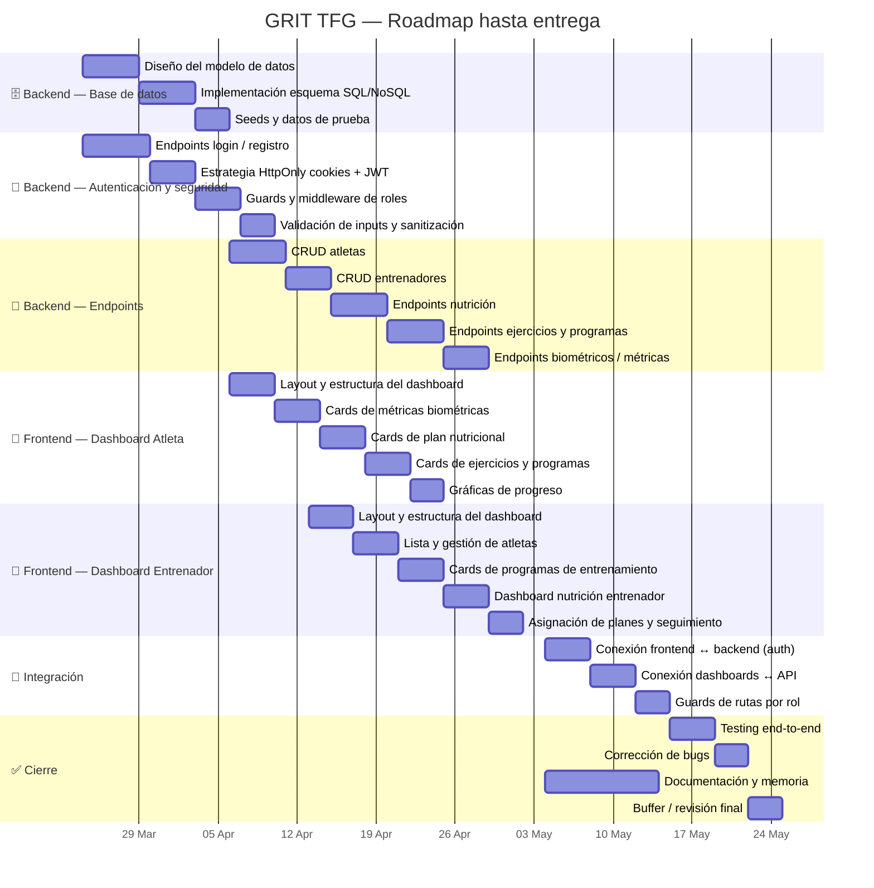

# GRIT — Plan de desarrollo TFG
**Período:** 24 Mar → 25 May 2026 · **Entrega:** 25 Mayo 2026

---

## Resumen por semanas

| Semana | Fechas | Frontend | Backend |
|---|---|---|---|
| 1 | 24 Mar – 30 Mar | — | Diseño DB + Auth endpoints |
| 2 | 31 Mar – 06 Abr | — | Seguridad, cookies, guards |
| 3 | 07 Abr – 13 Abr | Dashboard atleta — layout + métricas | CRUD atletas y entrenadores |
| 4 | 14 Abr – 20 Abr | Dashboard atleta — nutrición + ejercicios | Endpoints nutrición |
| 5 | 21 Abr – 27 Abr | Dashboard entrenador — layout + atletas | Endpoints ejercicios y programas |
| 6 | 28 Abr – 04 May | Dashboard entrenador — programas + nutrición | Endpoints biométricos |
| 7 | 05 May – 11 May | Integración auth + dashboards ↔ API | Integración y ajustes |
| 8 | 12 May – 18 May | Guards de rutas + testing | Testing y seguridad final |
| 9 | 19 May – 25 May | Bug fixes + revisión final | Bug fixes + documentación |

---

## Pendiente Frontend

- [ ] Dashboard atleta — cards métricas biométricas
- [ ] Dashboard atleta — cards plan nutricional
- [ ] Dashboard atleta — cards ejercicios y programas
- [ ] Dashboard atleta — gráficas de progreso
- [ ] Dashboard entrenador — gestión de atletas
- [ ] Dashboard entrenador — asignación de programas
- [ ] Dashboard entrenador nutrición — planes por atleta
- [ ] Guards de rutas por rol (CanActivate)
- [ ] Integración con API (HTTP calls, interceptors)

## Pendiente Backend

- [ ] Modelo de datos (DB schema)
- [ ] Endpoints autenticación (login, register, logout, refresh)
- [ ] Middleware de roles y autenticación
- [ ] CRUD atletas
- [ ] CRUD entrenadores
- [ ] Endpoints nutrición (planes, macros, historial)
- [ ] Endpoints ejercicios y programas de entrenamiento
- [ ] Endpoints métricas biométricas
- [ ] Validación y sanitización de inputs
- [ ] Tests de integración

---

> **Entrega final: 25 de Mayo de 2026**
