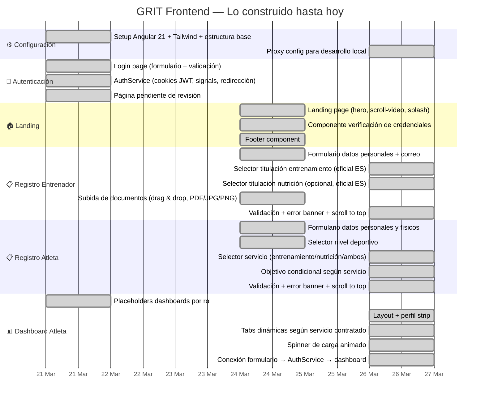

# GRIT — Frontend realizado hasta hoy
**Período:** 21 Mar → 26 Mar 2026

---

## Resumen por día

| Fecha | Qué se hizo |
|---|---|
| 21 Mar | Setup, login, AuthService, dashboards placeholder, página pendiente |
| 24 Mar | Landing, footer, registro entrenador, registro atleta |
| 25 Mar | Reestructuración de archivos, navigation flow |
| 26 Mar | Proxy, campo servicio + objetivo condicional, titulaciones oficiales, scroll to top, dashboard atleta completo |

---

## Componentes y páginas completadas

| Archivo | Estado |
|---|---|
| `pages/landing` | ✅ |
| `pages/login` | ✅ |
| `pages/entrenador` | ✅ |
| `pages/atleta` | ✅ |
| `pages/pendiente` | ✅ |
| `pages/dashboard-atleta` | ✅ estructura + tabs |
| `pages/dashboard-entrenador` | 🔲 placeholder |
| `pages/dashboard-entrenador-nutricion` | 🔲 placeholder |
| `components/footer` | ✅ |
| `components/hero` | ✅ |
| `components/splash` | ✅ |
| `components/scroll-video` | ✅ |
| `components/verification` | ✅ |
| `components/role-selector` | ✅ |
| `components/grit-loader` | ✅ |
| `services/auth.service` | ✅ signals + mock |

---

> **Hoy:** 26 de Marzo de 2026
